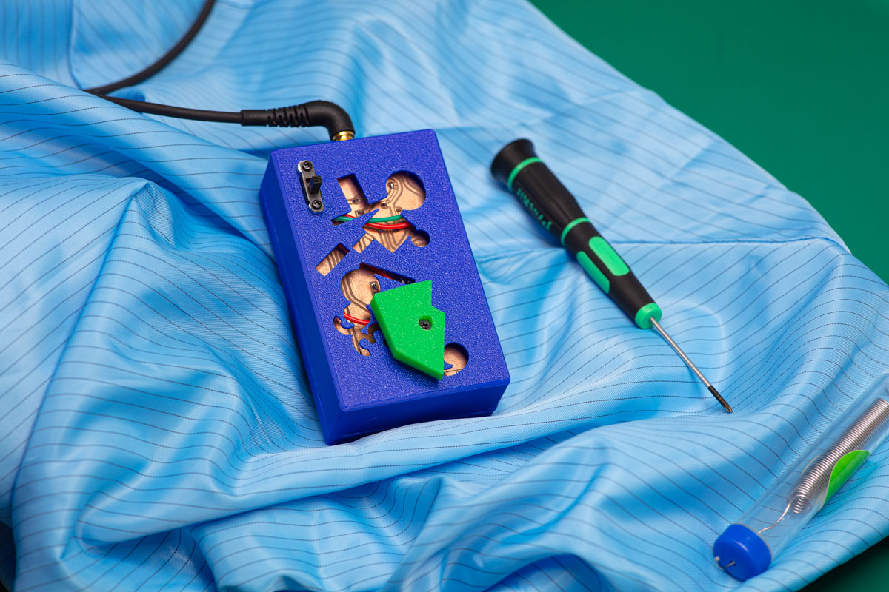

# 636_Radio
Modern replica of China's first domestically produced single transistor AM radio

## PCB / Gerbers
This replica is deisgned in a way it is easy to solder for beginners on a pcb made 'at home'. This means, optimized for single side copper clad boards.
The pcb is designed in KiCad. If you want to produce this board directly, the latest 'gerber' files can be found [here](https://github.com/dennisdebel/636_Radio/tree/main/gerbers-may6-2024)

## Case
The [case](https://github.com/dennisdebel/636_Radio/tree/main/636-radio-case) and tuner button are designed in OpenSCAD based on the excellent [YAPP_box](https://github.com/mrWheel/YAPP_Box) (Yet Another Parametric Projectbox generator). Find the printable box [here](https://github.com/dennisdebel/636_Radio/blob/main/636-radio-case/636-radio-case-2.1.stl)

## Bill Of Materials
The bill of materials and interactive assembly guide can be found [here](bom/ibom.html). Please ignore the footprint names of some of the components, namely C1 (this is a variable capacitor) and L1 (AM ferrite antenna).

Let me know if you have any issues, suggestions and/or questions!
